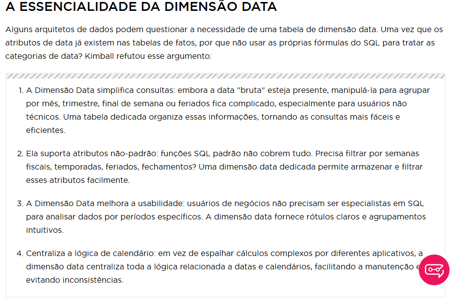
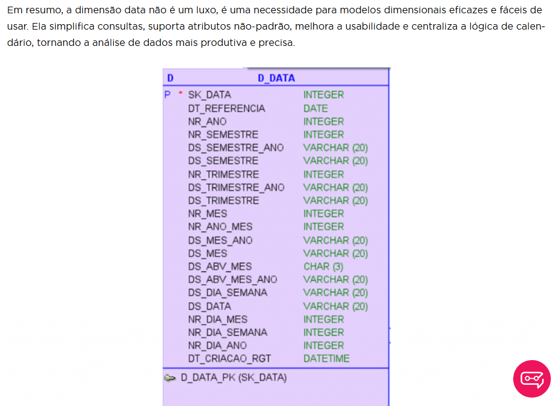
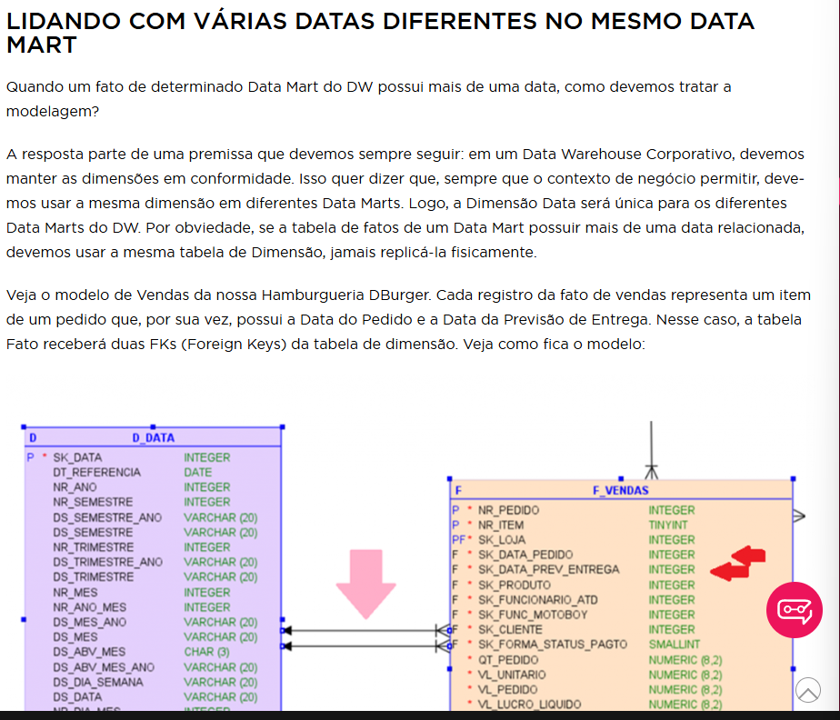

#   Dimensões

## Dimensões DATA

*   Dimensão especial pois os processos terão o tempo permeando as sua métricas. As vendas, estoques, saldos contábeis , headcounts, esses indicadores são analisados ao longo do tempo. Por isso a dimensão data fará parte de todas as dimensões do data mart.

A tabela D_DATA estra duas vezes na consulta apenas com apelidos diferentes. Se comportam como duas dimensões dististas, mas fisicamente obtém apenas uma tabela no banco.

