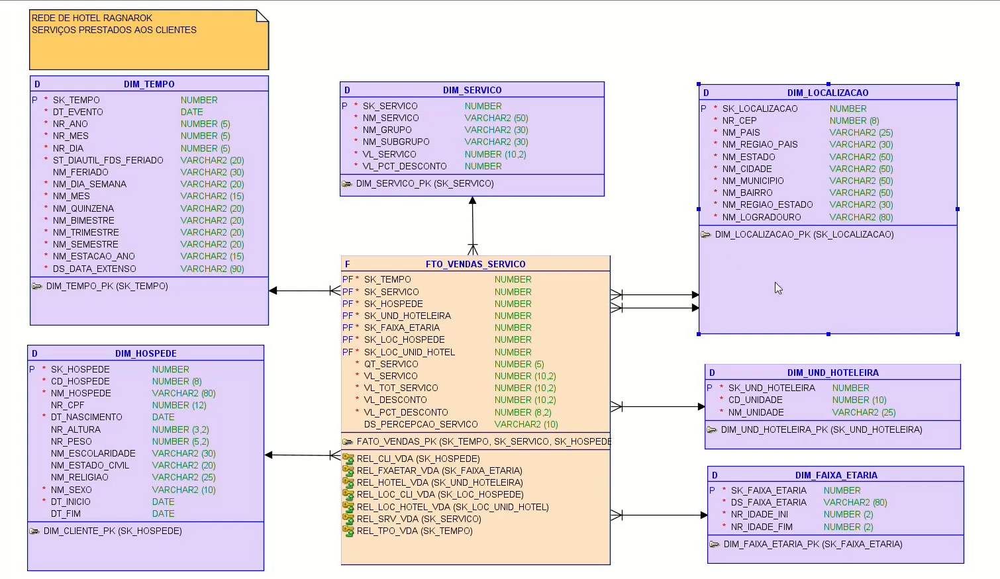
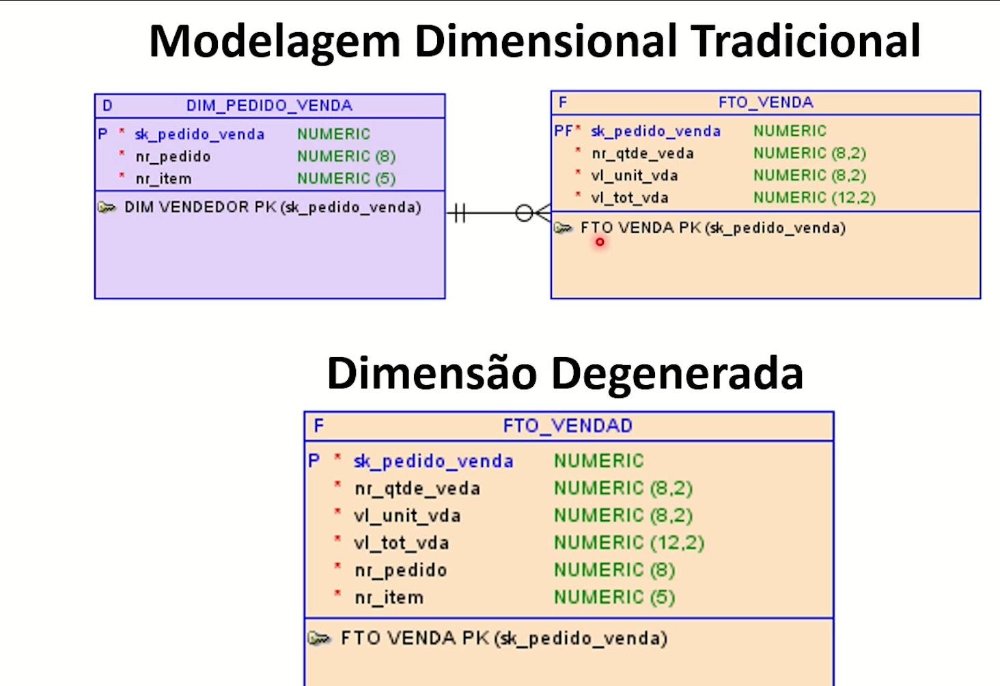
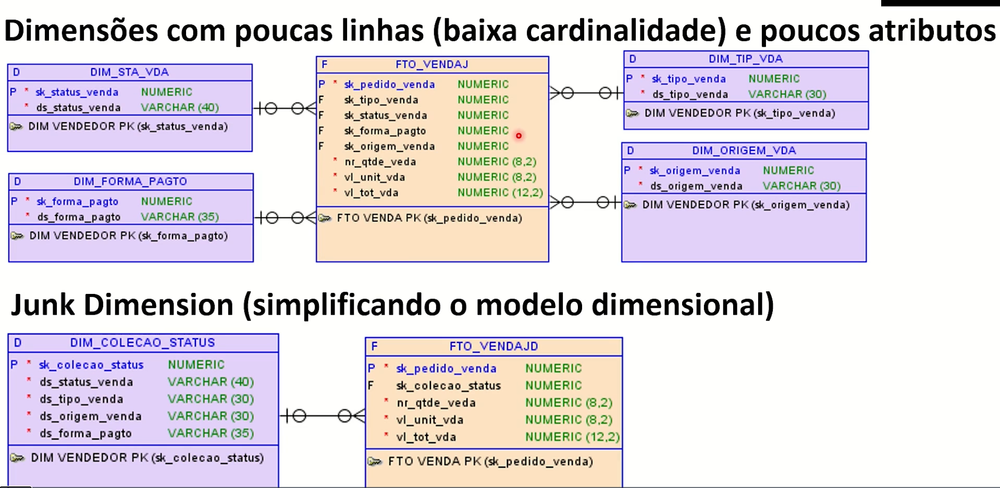
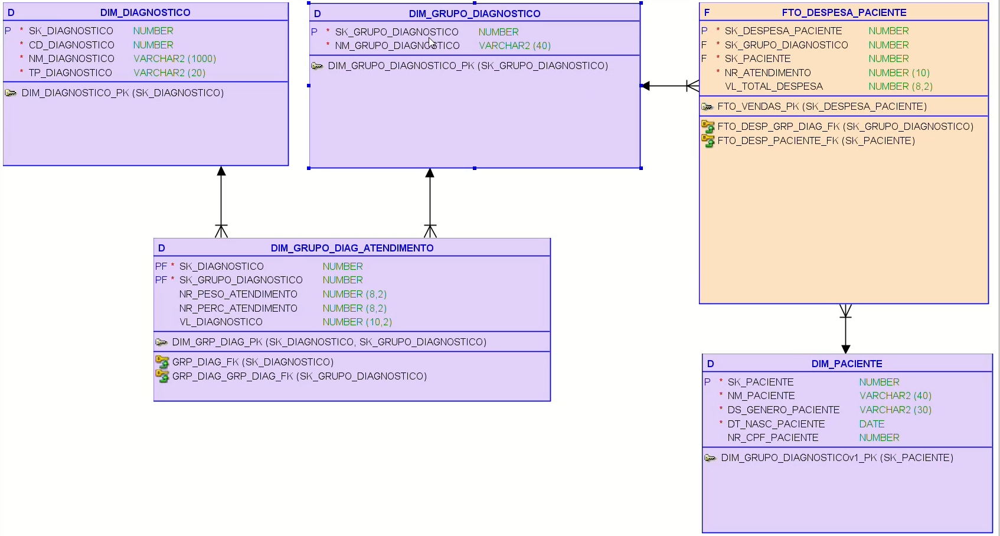

# Técnicas de modelagem avançada.

## ROLE-PLAYING

*   Tem a localização dos serviços prestados por unidade de hotel.

## DEGENERADA

*   Os atributos da tabela dimensão são incorporados na tebela fato, que diminui a complexidade e melhora o desempenho.

##  JUNK DIMENSION 

*   Dimensões que utilizam poucas linhas (baixa cardinalidade) que são incorporadas em apenas uma dimensão relacionado a uma fato.
*   Então em modelos dimensionais com muitas dimensões, porém com poucos atributos é melhor condensar em apenas uma dimensão.

##  BRIDGE TABLE

*   Funciona como uma ponte entre as dimensões.
*   Neste caso nas situações onde um paciente tem vários diagnósticos utliza-se o método bridge table
*   Existem duas tabelas dimensões

