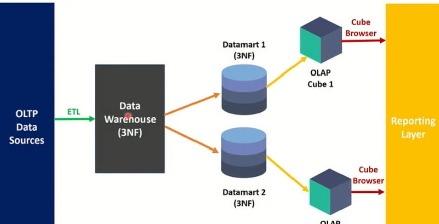

# Modelagem dimensional

Para criar dados analíticos é utilizadoa modelagem dimensional. Como criar modelos dimensionais a partir de bases de dados relacionais ?
Transforma dados em decisões vencedoras. Design de bancos de dados analíticos. Muitos bancos de dados relacionais foram criados nos anos 80, e tiveram a
ideia de usar para tomar decisões, mas o problema é que o banco de dados realcional é transacional, precisa agrupar os dados e as intruções sql não dá conta
de fazer isso. Então a modelagem dimensional surgiu voltada mais para negócio e tomadas de decisão, diminuindo o volume de dados e organizando melhor os dados.
Então quando o modelo de dados tradicional era utilizado para análise de negócios, o problema de tempo de resposta dificultava o processo.

Existem dois fatores alinhados a falta de desempenho que contribuíram para a existência da modelagem dimensional.

1.  Complexidade dos modelos de dados relacionais : Era preciso grande capacidade técnica , e profisionais especializados na área de banco de dados,
que criava a dificuldade para gestores e analistas de negócios para criar insights dos dados. Esse fato resultou no distanciamento da área de negócios com o time de T.I afastando os dados do negócio sempre dependiam da equipe de T.I para extrair insights diretamente dos dados. 

2.  Abordagem mais intuitiva. Esse distanciamento trouxe dificuldades para o time de analytics , e atrasou projetos e projetos ficaram sem conclusão por exemplo.
Então foi preciso criar uma abordagem mais intuitiva que refletem como os usuários pensem sobre os dados no contexto empresarial.

Por isso surgiu a modelagem dimensional, com tabelas de fatos de dimensões para resolver esses problemas. Tournou consultas mais eficientes nos banco de dados além de 
reduzir o número de tabelas. A modelagem dimensional começou a ser implementada em 1980, a partir de 1990 utilizada para facilitar acesso aos dados armazenados em data warehouses.

Bill Inmon definiu a técnica de modelagem de dados para datawarehouse conhecida como top-down. Ele entende que os dados devem ser centralizados 
no datawarehouse de forma que a integridade dos dados seja mantida sendo flexível o suficiente para atender as necessidades do negócio, e mesmo que exista os desafios, não não sejam descartados para criar consultas.

* Construção centralizada de um datawarehouse, com uma visão única para a empresa.
* Os dados devem ser normalizados na terceira forma 3FN.
* Visa reduzir a redundância e conserva a integridade dos dados.

Começa com um entendimento detalhado dos requisitos de informação de toda organização. Também é conhecida como Corporate Information System. O esforço para gerar o cif é proporcional a quantidade de dados, sendo demorado para conclusão.

Os dados ficam armazenados em alto nível e ficam independentes de qualquer aplicação de negócios.

Para bill os data marts são criados somente se existir uma datawarehouse central. Os data marts server para ser reservatórios específicos para diferentes propósitos de análise.

Ralph Kimbal, define que  os dados devem ser organizados em cubos OLAP e tabales de dimensões e fato. Sua abordagem é conhecida como bottom-up. Os cubos são usado em processos OLAP.

Principais características da abordagem top-down

*   Normalização 
*   Orientação por assunto
*   Independência dos dados
*   Variação ao longo do tempo
*   Dados não voláteis

A abordagem Bottom-up

A metodologia de ralph kimbol começa com data marts independentes focados em focos e objetivos específicos e depois são integrados em formar uma data warehouse completo. Essa abordagem ganhou popularidade sob a top-down 

São construídos com uma tabela central de fato, rodeada por tabelas  de dimesão relacionadas.

Pontos positivos 

* Mais rápido, escopo reduzido de trabalho.
* Complexidade reduzida, sendo cada data mart concentrado em um assunto.
* Menor custo inicial, pois você não está integrando toda a  empresa em uma única solução.
* Velocidade de implementação
* Menor necessidade de gestão

Os dados são tratados e organizados de maneiras distintas quando falamos em OLTP (Online Transactional Processing) e OLAP (Online Analytical Processing).

## Modelagem de dados dimensional Star Schema

Sistema de apoio a tomadas de decisão. Adotada para criação de datawarehouse. Tabela central (fato) rodeada a suas respectivas dimensões. Tem um foco na necessidade do negócio. 
Formato de uma estrela.

Tabela fato roedada com suas dimensões. Nas tabelas dimensões tem atributos descritores que permite dar conceitos a tabela fato, e na fato atributos de medidas. 
O star schema tem foco em uma necessidade de negócio. 

### Construindo um modelo de dados dimensional (analítico) desde o início.

Conjunto de regras de negócio , 4 regras de negócio de otimização do projeto para que possa ter resultado em tempo ábil.

       
# Modelo de dados dimensional Snowflake

Surgiu em 1990 como uma variação do modelo de dados star schema.  Foi desenvolvido especificamente para normalizar dados em ambientes de datawarehousing. Um modelo floco de modo está mais próximo de um diagrama de entidade - relacionamento , porque os dados de dimensão são normalizados. 

Esse modelo é utilizado em caso onde a normalização de dados é priorizada.  Uma tabela de dimensão pode ser dividida em várias tabelas por exemplo. Os atributos são divididos em tabelas, nada uma ideia de hierarquia.

# Modelagem dimensional de dados CONSTELAÇÃO

Conjunto de várias tabelas de fato que compartilham tabelas de dimensções em comum.

