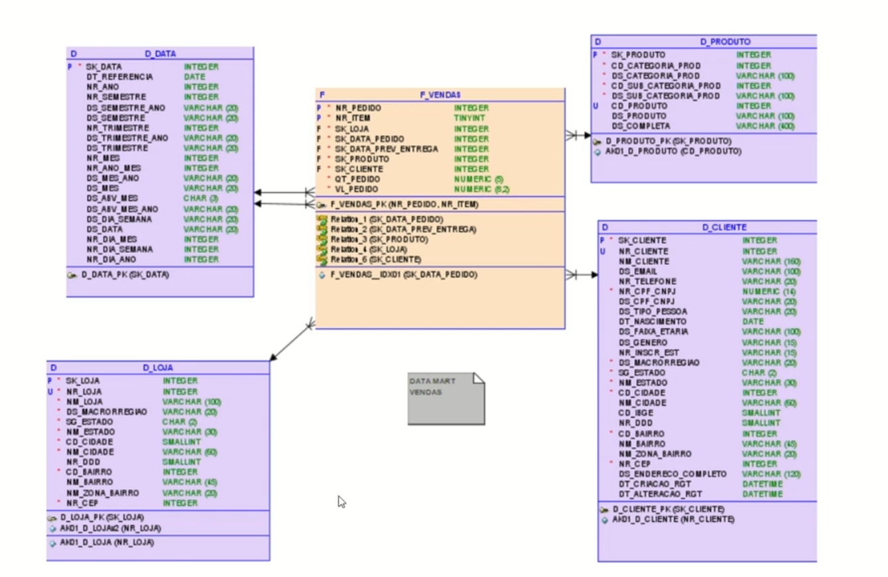

# Modelos Flattned, flat table. No contexto de data warehouse

*   Flattned table são estruturas de dados comumente utilizados em ambientes de DW para um acesso simplificado aos dados, mas atendem objetivos específicos de negócio. São tabelas desnormalizadas que encotram atributos quantificadores(tabelas fato) e qualificadores(tabelas dimensão).

*   Essas tabelas podem ser tanto atômicas (no menor nível da informação) quanto agregadas ou sintéticas. Facilitam o acesso aos dados sem a necessidade de joins. Facilita para um funcionário que não sabe fazer join por exemplo, para explorar dados como em uma grande planilha de excel. 

*   Oferece benefícios, e pode ser adotada com alternativas para modelos de dados dimensionais tradicionais starschema e snowflake. 

*   Tem baixa performance quando o volume de dados é muito grande. E pode ter maior custo.

*   Utilizada para análises ad hoc , são consultas personalizadas que o usuário tem facilidade de manipular os dados. 

*    Prototipação, é utilizado flattned table também.

*   Analisa dados de fontes alternativas, como dados de parceiro de negócios.

*    Pode ser um problema, para grnades volumes de dados, tem mais bytes por registro, porque os dados dos qualificadores se repetem tantas vezes quanto houver registros na tabela .

## Exemplo de modelo dimensional tradicional

