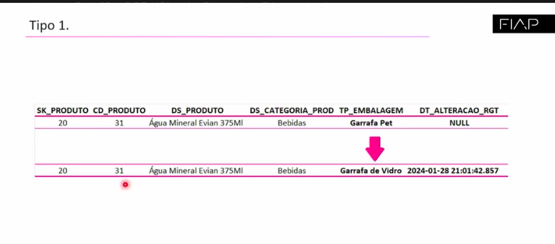
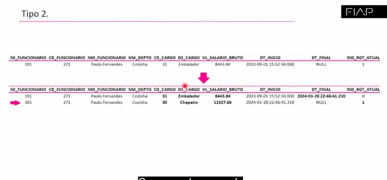
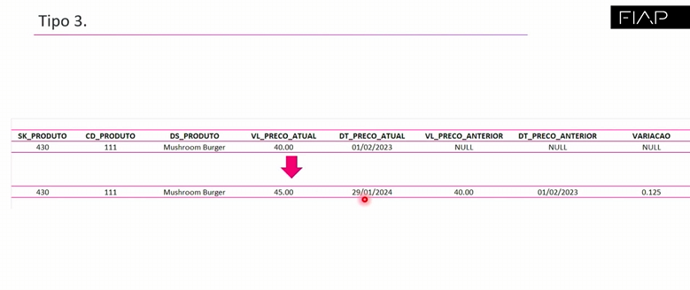

#   Slowly Changing Dimension

*   Dimensões que mudam lentamente.
1.  Tipo 1
2.  Tipo 2
3.  Tipo 3

*   Atributos das dimensões podem mudar ao longo do tempo, como um preço de um produto, entre outras, precisam ser controladas no datawarehouse. 

*   Ralph Kimball define apenas três tipos de dimensões que mudam lentamente.

1.  Não registra histórico nas mudanças simplesmente muda . Exemplo idade de funcionário.

2.  Quando ocorre mudança, adiciona registro e o histórico fica. Exemplo cargo e salário de um funcionário.

3.  Não adiciona registro novos mas matém o histórico em diferentes colunas

*   Cada método depende do modelo de negócio.

