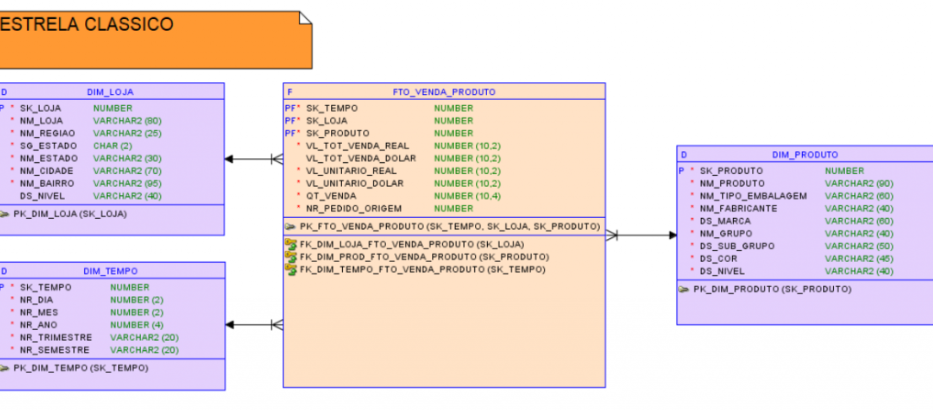
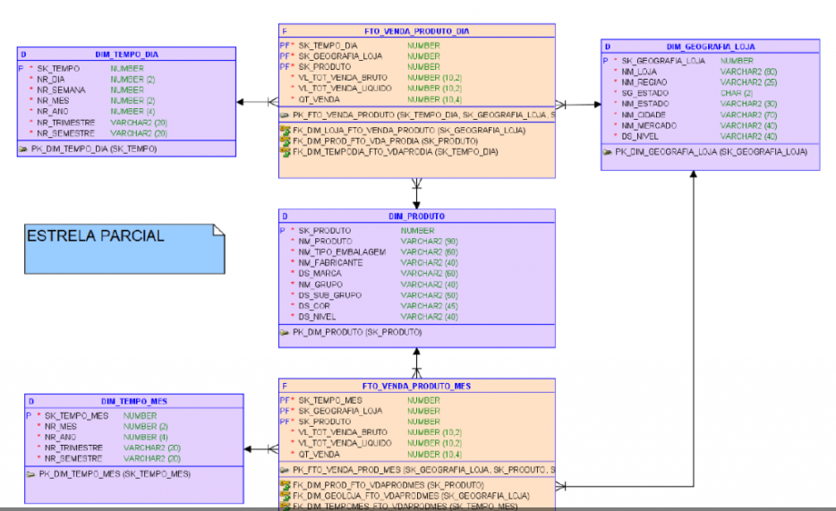
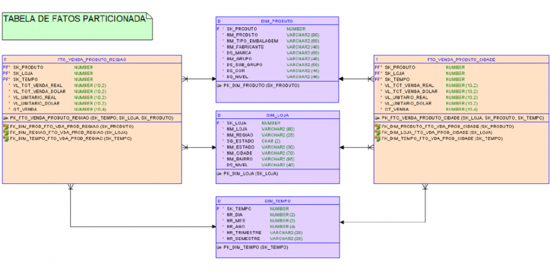
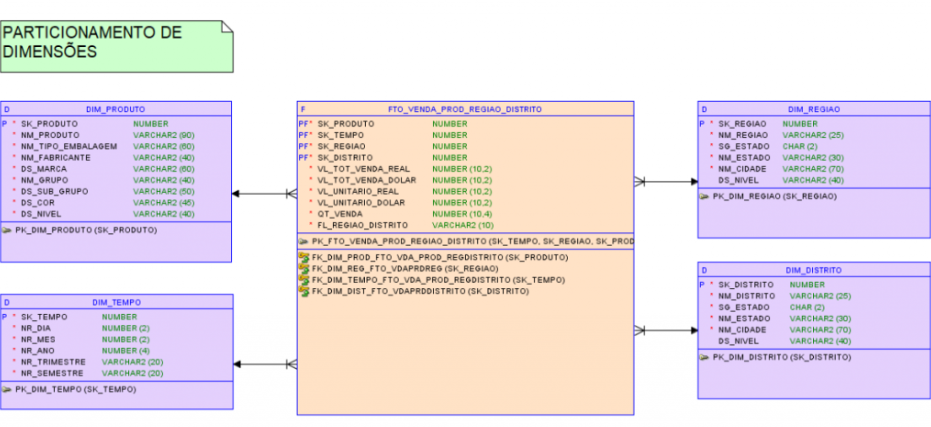
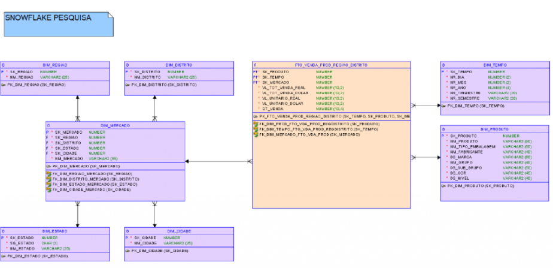
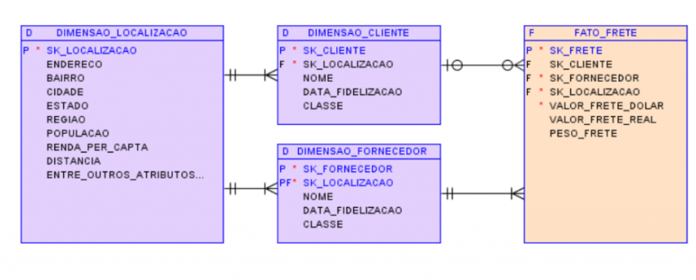
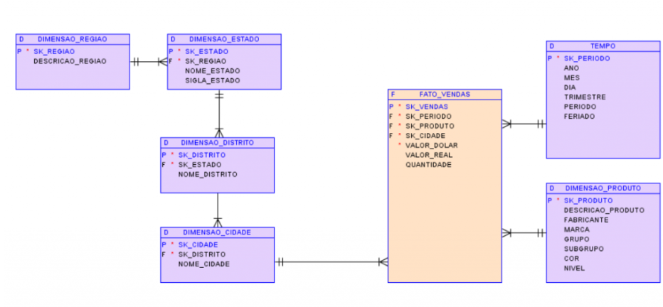

# Variantes do modelo de dados dimensional Star Schema

*   Estrela clássico
*   Estrela parcial
*   Tabela de fato particionada
*   Tabela de dimensão particionada

## Estrela clássico

1.  Tabela fato contem detalhes de dados de niveis de acordo com o grao determinado pela necessidade de negócio.

2.   Cada dimensão é representada na tabela fato por uma surrogate key

3.   A chave primária da tabela fato é composta por cada chave de suas dimensões

4.   As chaves são geradas automaticamente pelo sistema 

## Estrela parcial

Algumas dimensões mão estão associadas a tabela fato. Traz mais flexibilidade, pois trazer maior complexidade entre as relações.
Pode ocorrer maior redundância de dados do que o modelo floco de neve. Embora menos redundância em relação  

## Fato particionada

Existe mais de uma tabela fato, porém todas as dimensões são conectadas a table fato.
Técnica de modelagem dimensional para datawarehousing para otimização da gestão e desempenho na consulta de grandes volumes de dados. Várias
tableas fato podem compartilhar uma mesma tabela dimensão. 

## Dimensão particionada

Dimensões divididas acessando a mesma tabela fato. As dimensões são divididas em partições 

# Variantes de modelos de dados dimensional Snow Flake

*   Floco de neve pesquisa
*   Floco de neve atributo
*   Floco de neve cadeia

## Pesquisa 

Permite dar flexibilidade na forma como consulta os dados.

## Atributo

Normaliza atributos ne negócio dentro de tabelas dimensionais

## Cadeia

Caracterizar uma estrutura nomalizada. Faz uma hierarquia dos atributos.

